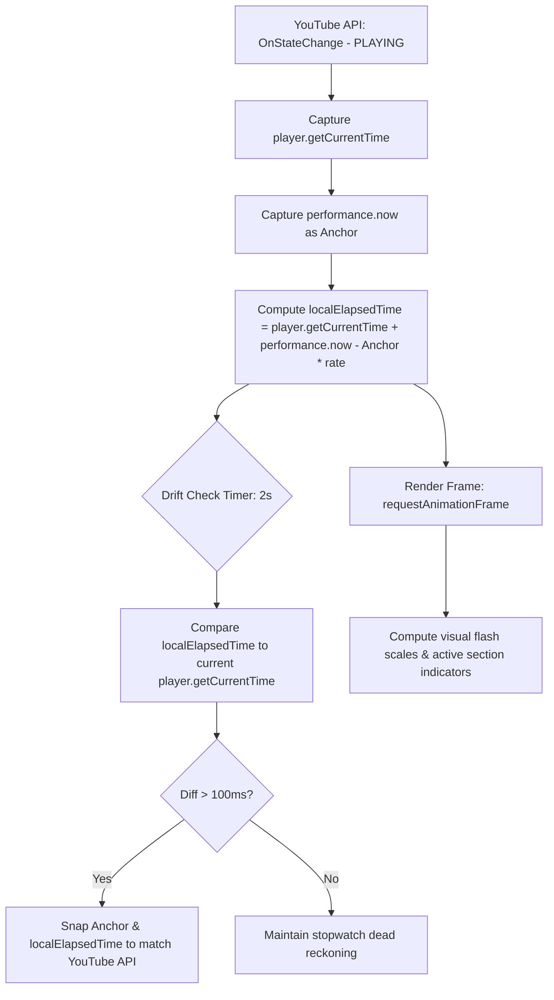

# Product Requirements Document (PRD) & MVP Specification
## Project: Salsa Rhythm Learning Hub
**Platform:** Mobile-First Web App (Hosted on GitHub Pages)  
**License:** Proprietary / All Rights Reserved (Explicitly forbids unauthorized external hosting, copying, or distribution)

---

## 1. Executive Summary
The **Salsa Rhythm Learning Hub** is a lightweight, serverless web application designed as an interactive ear-training tool and rhythm game for salsa and bachata students. The app embeds YouTube videos of Latin music and synchronizes a visual interface and tap-testing mechanics to the downbeats and structural energy shifts (e.g., Montuno, Majao).

### The Use Case Reality
The primary physical interaction is tapping a mobile screen while sitting or standing stationary. It serves as an intensive listening, ear-training, and timing drill rather than an active physical dancing companion. This "stationary rhythm game" dynamic dictates strict requirements for UI protection, highly responsive micro-animations, and millisecond synchronization.

---

## 2. Technical Stack & Project Architecture

### Core Stack
*   **Frontend Framework:** React + Vite (Fast, modular component structure, and optimized build pipeline for GitHub Pages).
*   **Styling:** Vanilla CSS (CSS Variables, HSL-based colors, responsive flex/grid layouts, keyframe animations, glassmorphism).
*   **Hosting:** GitHub Pages (Static, serverless, automated deployments via GitHub Actions).
*   **Media Server / Player:** YouTube IFrame Player API.
*   **Data Storage:** Static Immutable JSON files served from the repository (No backend database required for MVP).
*   **Analysis/ETL Pipeline:** Python for library testing, stem separation, and XML/JSON beat generation.

### Workspace Directory Structure
```text
musicality/
├── .github/
│   └── workflows/
│       └── deploy.yml          # GitHub Pages automated deployment
├── public/
│   ├── songs/                  # Immutable beatmap JSON files
│   │   ├── catalog.json        # Central song list registry
│   │   └── Co99G2Z_rF0.json    # Individual song beatmaps (by YouTube ID)
│   └── favicon.ico
├── src/
│   ├── assets/                 # SVGs, icons, fallback images
│   ├── components/
│   │   ├── AudioShield.jsx     # Transparent overlay blocking direct iframe clicks
│   │   ├── ControlBar.jsx      # Custom play, pause, speed, rewind buttons
│   │   ├── GameCanvas.jsx      # Tapping area and visual pulse elements
│   │   ├── SongSelector.jsx    # Smooth, sliding song library view
│   │   └── Visualizer.jsx      # Ear-training flashes and section alerts
│   ├── hooks/
│   │   └── useSyncEngine.js    # The Dead-Reckoning Stopwatch Custom Hook
│   ├── App.jsx                 # Core routing, theme context, state coordinator
│   ├── index.css               # Design System (Tokens, Animations, Reset)
│   └── main.jsx
├── scripts/
│   ├── test_mir_libraries.py   # Script for comparing librosa, aubio, and madmom
│   ├── separate_stems.py       # Demucs/Spleeter wrapper to isolate percussion stems
│   └── rekordbox_parser.py     # Fallback ETL script converting DJ XML to schema JSON
├── .gitignore                  # Blocks temp files and *.json from polluting repository
├── package.json
└── salsa_rhythm_prd_mvp.md    # This specifications document
```

---

## 3. Core Modes & Feature Specifications

### 3.1 Learning Mode (Ear Training & Musicality)
*   **Unified 8-Count Engine:** 
    *   Both Salsa and Bachata are structured on an 8-beat cycle (two 4-beat measures).
    *   The visual count track contains 8 circular pulses.
    *   **Salsa Accents:** For Salsa On1, beats `1` and `5` glow brighter with a golden neon pulse (primary downbeats), while `2, 3` and `6, 7` flash standard cyan. Beats `4` and `8` represent the pauses, pulsing with low opacity or a custom passive indicator. For Salsa On2, beats `2` and `6` receive the highlight.
    *   **Bachata Accents:** Beats `1, 2, 3` and `5, 6, 7` flash standardly, while beats `4` and `8` display a distinct visual cue representing the signature bachata "tap/hip-lift" transition.
*   **Dynamic Section Cues:**
    *   The UI container theme changes background colors and pulse intensities when structural transitions occur.
    *   *Salsa:* Transitioning from the Verse (soft) to the *Montuno* (high energy chorus/coro) shifts the color palette from a cool dark violet to a hot electric orange/pink, increasing the pulse scale.
    *   *Bachata:* Transitioning to *Majao* (driving bongo-guira groove) shifts styling to an energetic deep teal, with glowing neon green accents.
*   **Visual Instrument Focus (The Emoji Method):**
    *   Due to browser CORS and YouTube sandbox constraints, isolated audio processing is impossible.
    *   A prominent visual banner pops up at the start of a structural section indicating which instrument to focus on:
        *   🔔 **Focus: Cowbell (Campana)** during Salsa Montuno.
        *   🪘 **Focus: Bongó (Martillo)** during Salsa Verse.
        *   🪇 **Focus: Güira** during Bachata Majao.
        *   🎸 **Focus: Requinto Guitar** during Bachata Intro/Derecho.

### 3.2 Practice Mode (Rhythm Game)
*   **Blind Tapping:** Visual rhythm indicators, guides, and numbers are hidden. Only a large, central tapping zone remains active.
*   **Strict Timing Evaluation (Hit Windows):**
    *   Every user tap captures `performance.now()`. The sync engine calculates the delta to the nearest target beat in the JSON beatmap.
    *   **Timing Ratings:**
        *   ⭐ **Perfect:** $\le \pm 60\text{ ms}$ (Double points, gold pulse, custom pop-up word: "Perfect!").
        *   ⚡ **Good:** $\le \pm 120\text{ ms}$ (Single points, cyan pulse, custom pop-up word: "Good!").
        *   ❌ **Miss:** $> \pm 120\text{ ms}$ or tapping during non-beat intervals.
*   **Combo & Multiplier System:**
    *   Every consecutive "Perfect" or "Good" hit increments the **Combo Counter**.
    *   Every 10 combo steps increases the **Score Multiplier** (1x $\rightarrow$ 2x $\rightarrow$ 3x $\rightarrow$ 4x max).
*   **Anti-Spam & Button-Mashing Protection:**
    *   If a tap is registered in "empty space" (outside of any hit window), it is immediately categorized as a **Miss Penalty**.
    *   A Miss Penalty instantly resets the Combo Counter to 0, drops the Score Multiplier back to 1x, triggers a violent red screen flash, and vibrates the phone (if supported by `navigator.vibrate`).
    *   No input throttling or disabling is used. Tap responsiveness remains 100% fluent, but button mashing is heavily penalized in the score and visual feedback.

---

## 4. The Sync Engine (Dead Reckoning)



### 4.1 The Stopwatch Core
`player.getCurrentTime()` is low-precision and updates infrequently (~250ms). To achieve sub-10ms visual synchronization, the app uses an internal high-resolution stopwatch:
1.  **Sync Trigger:** When the YouTube IFrame player triggers `onStateChange` equal to `YT.PlayerState.PLAYING`:
    *   Capture `T_yt = player.getCurrentTime()`.
    *   Capture `T_perf = performance.now()`.
2.  **Current Time Calculation:** At any rendering frame $t$, the current virtual track time $T(t)$ is calculated as:
    $$T(t) = T_{yt} + \left( \frac{\text{performance.now}() - T_{perf}}{1000} \right) \times R$$
    where $R$ is the current playback rate (e.g. `1.0`, `0.75`, `0.5`).

### 4.2 Drift Correction Loop
A background timer runs every 2,000ms:
*   Retrieve the actual YouTube playhead `T_real = player.getCurrentTime()`.
*   Calculate absolute difference `|T(t) - T_real|`.
*   If `diff > 0.1` (100ms), update the anchor points:
    `T_yt = T_real` and `T_perf = performance.now()`.
*   This corrects minor browser lag or background throttle drifts without introducing continuous visual stutter.

### 4.3 Speed Adjustments & Seeking
*   **Speed Toggles:** Toggling playback rate (via `player.setPlaybackRate`) forces an immediate update to the Sync Engine. The anchor variables `T_yt` and `T_perf` are recaptured immediately, and the multiplier $R$ is updated.
*   **Seeking:** Any rewind or skip action divorces stopwatch time from the video time. Seeking triggers an immediate freeze of the stopwatch engine. A fresh synchronization anchor is established once the player outputs its first `PLAYING` event post-seek.

### 4.4 Mobile-First Resiliency
*   **Tab Backgrounding (Page Visibility API):** Mobile operating systems aggressively sleep JavaScript thread execution (including `performance.now()`) when a tab is hidden, but standard YouTube audio may continue.
    *   Add event listener for `visibilitychange`.
    *   If `document.hidden`, immediately call `player.pauseVideo()` and pause the Sync Engine.
    *   Upon return (`document.visible`), trigger a complete Sync Engine hard reset.
*   **iOS Native Hijack Protection:**
    *   The YouTube IFrame constructor **MUST** be initialized with:
        ```javascript
        playerVars: {
          playsinline: 1,
          controls: 0,
          rel: 0,
          showinfo: 0,
          enablejsapi: 1
        }
        ```
    *   This forces inline page rendering on iOS Safari and prevents hijacking by Apple's fullscreen quicktime player.

---

## 5. UI Layout, Transparent Shield & Controls

### 5.1 Mobile-First Viewport Rules
*   Locked to vertical orientation in styling (flexible heights, no horizontal scrolling allowed).
*   Maximum height structured as 100vh using dynamic CSS `100dvh` to handle mobile address bar expansions.

### 5.2 Layered Visual Architecture
The screen is split into three layered zones to protect gameplay:

1.  **The Transparent Shield:** A full-coverage HTML `div` with `pointer-events: auto; background: transparent; z-index: 10;` is positioned precisely over the YouTube IFrame.
    *   **Function:** It intercepts all screen taps. The student can mash the screen during practice without ever triggering YouTube's pause overlay, opening YouTube external ads, or redirecting to the native app.
2.  **Custom Touch Control Bar:** Placed at the very bottom, containing large, fat-finger-friendly touch buttons (minimum size `48px` x `48px` with clear padding):
    *   **Play/Pause Toggle:** Custom SVG indicator icon.
    *   **Speed Selector:** Multi-state toggle (`0.5x` / `0.75x` / `1.0x`).
    *   **Rewind 10s:** Instant seek backwards (forces instant hard-re-sync).
    *   **Report Issue:** Small secondary link to trigger a pre-formatted GitHub issue for broken embeds.

---

## 6. Shared Data Schema (NoSQL Ready)

To ensure interoperability, clean JSON loading, and potential future migration to a NoSQL database (like MongoDB or Firestore), the schema encapsulates metadata, sections, custom events, and individual beat points in one file.

### Schema Spec (`schemaVersion: "1.1"`)
```json
{
  "id": "song-salsa-lloraras-01",
  "schemaVersion": "1.1",
  "metadata": {
    "songTitle": "Llorarás",
    "artist": "Oscar D'León",
    "danceStyle": "salsa",
    "youtubeId": "Co99G2Z_rF0",
    "bpm": 182.00,
    "difficulty": "medium"
  },
  "sections": [
    {
      "name": "Intro",
      "startTimestamp": 0.000,
      "focus": "brass",
      "emoji": "🎺"
    },
    {
      "name": "Derecho",
      "startTimestamp": 10.500,
      "focus": "bongo",
      "emoji": "🪘"
    },
    {
      "name": "Montuno",
      "startTimestamp": 45.200,
      "focus": "cowbell",
      "emoji": "🔔"
    }
  ],
  "events": [
    {
      "type": "break",
      "startTimestamp": 32.400,
      "durationInBeats": 8,
      "description": "Percussion Solo Break"
    }
  ],
  "beats": [
    { "timestamp": 0.330, "beat": 1 },
    { "timestamp": 0.660, "beat": 2 },
    { "timestamp": 0.990, "beat": 3 },
    { "timestamp": 1.320, "beat": 4 },
    { "timestamp": 1.650, "beat": 5 },
    { "timestamp": 1.980, "beat": 6 },
    { "timestamp": 2.310, "beat": 7 },
    { "timestamp": 2.640, "beat": 8 }
  ]
}
```

---

## 7. Python Data Pipeline & MIR Library Evaluation Plan

Since Latin rhythm downbeats are highly complex due to polyrhythms and anticipated patterns, our data pipeline involves a dedicated phase to research, test, and validate automated beat-mapping libraries.

### 7.1 Automated Library Testing Phase (First Task)
We will construct a Python research test bench (`scripts/test_mir_libraries.py`) to systematically compare standard audio analysis frameworks on a curated set of Salsa and Bachata tracks:
1.  **Librosa (Beat Tracker):** Measures standard spectral flux and onset strength envelopes.
2.  **Aubio (Onset/Beat):** Uses transient detection algorithms tailored for real-time low-latency beat tracking.
3.  **Madmom (Deep Learning Beat/Downbeat):** Utilizes Recurrent Neural Networks (RNNs) and state-of-the-art DBN (Dynamic Bayesian Network) models for beat and downbeat tracking (highly effective for syncopated structures).
4.  **Demucs (Stem Separation):** Isolates drums, bass, vocals, and melody stems. By separating the drum stem and bass stem first, we can run Librosa or Madmom specifically on *percussive stems* (like cowbell or bongo) to bypass syncopated brass/vocals, dramatically improving beat accuracy.

### 7.2 Human-In-The-Loop (HITL) Alignment Flow
If automated models fall short on polyrhythms, the fallback pipeline is:
1.  Import audio into DJ Software (Rekordbox).
2.  Manually line up grid markers and drop Memory Cues for section names.
3.  Export collection XML.
4.  Run `scripts/rekordbox_parser.py` to extract cues, BPM, and extrapolate beats based on grid anchors into the final JSON beatmap.

---

## 8. Quality Assurance & Verification Plan

### 8.1 Automated Testing
*   **Unit Tests (Vitest):**
    *   Verify the mathematical core of the Sync Engine: ensure speed adjustments accurately scale elapsedTime.
    *   Verify Hit Window logic: feed artificial millisecond differences (e.g. -50ms, +95ms, +150ms) and confirm correct categorization (Perfect, Good, Miss).
    *   Verify scoring calculations, combo accumulation, and penalty resets.
*   **Static Code Analysis:** ESLint and Prettier rules to keep code structured and clean.

### 8.2 Manual & Mobile Verification Checklist
*   [ ] **Embedded Video Verification:** Manually test the designated video in a local browser to check if restricted from third-party embedding.
*   [ ] **Pointer-Shield Test:** Try clicking the center of the playing video. Confirm no YouTube pause, ads, or links are triggered.
*   [ ] **Background Visibility Test:** Minimize the browser tab or switch apps while video is running. Confirm that the video pauses immediately and that resuming synchronizes the visual clock flawlessly.
*   [ ] **Playsinline Test (iOS):** Open the local server on an iPhone via Safari. Click play and verify the video does not expand into Apple's fullscreen system media player.
*   [ ] **Drift Stress Test:** Artificially lag the thread (e.g., rapid tab resizing or CPU throttling in DevTools). Check if drift correction smoothly snaps beats back to place at the 2-second interval mark.

---

## 9. Workflow, Contributions & Legal Protections

### 9.1 Contribution Legalities & Proprietary Policy
*   **All Rights Reserved:** Code and custom asset mappings are proprietary intellectual property. 
*   **DMCA Compliance:** Unauthorized redistribution, mirroring, or repackaging under separate domains will be subjected to immediate DMCA takedown actions.
*   **Contributor License Agreement (CLA):** Any external contribution (such as community song beat-maps submitted through a future dashboard or GitHub PRs) must sign/accept a CLA transferring exclusive rights of the submission to the primary project owner, keeping the repository legally secure.

### 9.2 Developer & AI Directives (Strict Enforcement)
*   **pnpm Package Locking Directive (CRITICAL):** We use `pnpm` exclusively for package management to strictly lock all versions. Automatic package updates are strictly forbidden. Under no circumstance should a build, run, or normal install command perform auto-updates. Any package updates, upgrades, or additions must be executed through an explicit, manual, and separate command.
*   **Feature Branching:** All updates must be made on clean branches: `git checkout -b feature/[name]` and merged through a pull request.
*   **Local Test Protection:** Local generated output test maps or scrap files should remain uncommitted. `.gitignore` must keep XML dumps and temp tests out of the repo history.
*   **TDD Approach:** Core logic modules (hooks, sync math, score calculators) must be developed using a Test-Driven Development flow.
*   **Documentation Rule:** AI agents (including Antigravity) are strictly prohibited from touching or editing documentation files (`README.md`, `salsa_rhythm_prd_mvp.md`) during the step-by-step feature coding loop. Documentation files are ONLY allowed to be modified or expanded at the very end of a fully completed and tested task before a final commit is prepared.
